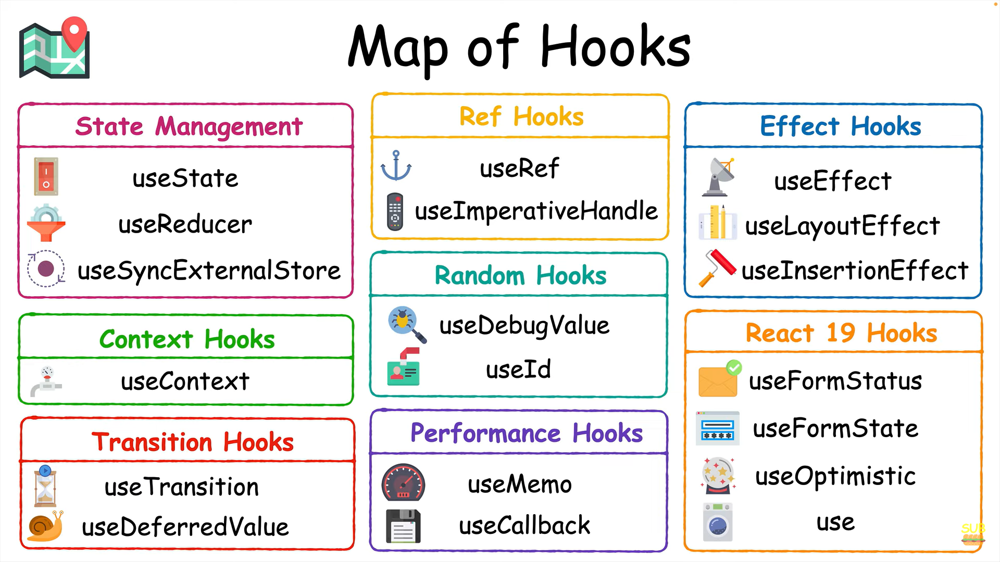

**GitHub Repository: React Hooks Tutorial**

**Introduction:**
Welcome to the comprehensive tutorial on React hooks! In this tutorial, we'll delve into the intricacies of React hooks, exploring their various types, use cases, and best practices. Whether you're a beginner or an experienced developer, this repository will equip you with the knowledge and skills to leverage React hooks effectively in your projects.


**Content:**
1. [State Management Hooks](#state-management-hooks)
2. [Effect Hooks](#effect-hooks)
3. [Ref Hooks](#ref-hooks)
4. [Performance Hooks](#performance-hooks)
5. [Context Hooks](#context-hooks)
6. [Transition Hooks](#transition-hooks)
7. [Random Hooks](#random-hooks)
8. [New Hooks in React 19](#new-hooks-in-react-19)

**State Management Hooks:**
- **useState:**
  - **Description:** useState is a fundamental hook in React used for managing component-level state. It allows components to maintain their state without needing class components.
  - **Best Use Cases:** useState is ideal for managing simple, local state within functional components. It's commonly used for handling user input, toggling UI elements, and managing component visibility.
  - **Example:**
    ```javascript
    import React, { useState } from 'react';

    function Counter() {
      const [count, setCount] = useState(0);

      return (
        <div>
          <p>Count: {count}</p>
          <button onClick={() => setCount(count + 1)}>Increment</button>
        </div>
      );
    }

    export default Counter;
    ```
  - **Explanation:** In the above example, useState is used to create a state variable called `count` initialized with a value of 0. The `setCount` function is used to update the `count` state whenever the button is clicked.

- **useReducer:**
  - **Description:** useReducer is an alternative to useState for managing more complex state logic in React. It accepts a reducer function and an initial state, returning the current state and a dispatch function for updating state.
  - **Best Use Cases:** useReducer is suitable for managing state that involves multiple actions or has a more intricate state transition logic. It's commonly used in scenarios like forms with complex validation, multi-step wizards, and global application state.
  - **Example:**
    ```javascript
    // Reducer function
    const formReducer = (state, action) => {
      switch (action.type) {
        case 'CHANGE':
          return { ...state, [action.field]: action.value };
        default:
          return state;
      }
    };

    // Usage
    const [formData, dispatch] = useReducer(formReducer, { name: '', email: '' });
    ```
  - **Explanation:** In this example, useReducer is used to manage form state. The `formReducer` function defines how state should be updated based on different actions like 'CHANGE'. The `formData` state contains the current form data, and the `dispatch` function is used to trigger state updates.

- **useSyncExternalStore:**
  - **Description:** useSyncExternalStore is a less commonly used hook designed to integrate non-React state management systems into React components. It allows components to synchronize their state with external data sources or custom state management libraries.
  - **Best Use Cases:** useSyncExternalStore is primarily used in advanced scenarios where components need to interact with external data sources or non-React state management systems. It's typically employed in large-scale applications with complex state management requirements.
  - **Example:** _(Example not provided as it's a less commonly used hook with specialized use cases.)_

**Effect Hooks:**
- **useEffect:**
  - **Description:** useEffect is a hook used for performing side effects in functional components. It runs after every render and can be used to execute code that interacts with the DOM, makes API calls, or subscribes to external data sources.
  - **Best Use Cases:** useEffect is versatile and can be used for various tasks such as fetching data from a server, subscribing to events, updating document title, and managing timers or intervals.
  - **Example:**
    ```javascript
    useEffect(() => {
      document.title = `Clicked ${count} times`;
    }, [count]);
    ```
  - **Explanation:** This useEffect hook updates the document title whenever the `count` state changes. The dependency array `[count]` ensures that the effect runs only when `count` changes, preventing unnecessary executions.

- **useLayoutEffect:**
  - **Description:** useLayoutEffect is similar to useEffect but runs synchronously after all DOM mutations. It's useful for operations that require immediate DOM updates before the browser paints.
  - **Best Use Cases:** useLayoutEffect is primarily used for tasks like measuring DOM elements, synchronizing state with the DOM, or performing imperative DOM manipulations.
  - **Example:**
    ```javascript
    useLayoutEffect(() => {
      const rect = ref.current.getBoundingClientRect();
      setDimensions({ width: rect.width, height: rect.height });
    }, []);
    ```
  - **Explanation:** In this example, useLayoutEffect is used to measure the dimensions of a DOM element referenced by `ref`. The dimensions are then stored in the component state using `setDimensions`.

**Ref Hooks:**
- **useRef:**
  - **Description:** useRef returns a mutable ref object whose `.current` property is initialized to the passed argument (initial value). The returned object persists for the entire lifetime of the component.
  - **Best Use Cases:** useRef is commonly used for accessing DOM elements, storing mutable values without triggering re-renders, and preserving values across renders without causing side effects.
  - **Example:**
    ```javascript
    const intervalId = useRef(null);
    ```
  - **Explanation:** This useRef hook creates a ref to store the ID of an interval timer. The ref persists across renders without causing re-renders, allowing for efficient management of the interval.

- **useImperativeHandle:**
  - **Description:** useImperativeHandle is used to customize the instance value that is exposed to parent components when using `ref.forwardRef`. It allows components to specify what values should be exposed on the ref instance.
  - **Best Use Cases:** useImperativeHandle is mainly used when components need to expose specific imperative methods or properties to parent components via refs.
  - **Example:** _(Example not provided as it's a less commonly used hook with specialized use cases.)_

**Performance Hooks:**
- **useMemo:**
  - **Description:** useMemo is used to memoize expensive computations and cache their results. It re-runs the memoized function only when its dependencies change.
  - **Best Use Cases:** useMemo is suitable for optimizing performance by caching computed values, especially in scenarios where calculations are resource-intensive or involve complex logic.
  - **Example:**
    ```javascript
    const memoizedValue = useMemo(() => computeExpensiveValue(a, b), [a, b]);
    ```
  - **Explanation:** This useMemo hook memoizes the result of `computeExpensiveValue` function based on the dependencies `[a, b]`. It ensures that the function is only recomputed when `a` or `b` changes.

- **useCallback:**
  - **Description:** useCallback is similar to useMemo but specifically used for memoizing callback functions. It returns a memoized callback function that only changes if one of its dependencies has changed.
  - **Best Use Cases:** useCallback is useful for preventing unnecessary re-renders in child components when passing callbacks as props, especially in scenarios where callback functions are recreated on each render.
  - **Example:**
    ```javascript
    const handleClick = useCallback(() => {
      console.log('Button clicked');
    }, []);
    ```
  - **Explanation:** This useCallback hook memoizes the `handleClick` function, ensuring that it remains the same between renders as long as its dependencies (empty array) don't change.

**Context Hooks:**
- **useContext:**
  - **Description:** useContext is used to consume context values provided by the nearest `Context.Provider` ancestor in the component tree. It simplifies accessing context values within functional components.
  - **Best Use Cases:** useContext is ideal for accessing global or shared state, theme configurations, user authentication status, and other context-specific data.
  - **Example:** _(Example not provided as it's a straightforward hook with common use cases.)_

**Transition Hooks:**
- **useTransition:**
  - **Description:** useTransition is a transition hook introduced in React to specify that certain state updates are not urgent and can be deferred. It improves app responsiveness by prioritizing critical updates over non-critical ones.
  - **Best Use Cases:** useTransition is useful for scenarios where state updates involve heavy computations or long-running tasks, such as filtering large datasets or rendering complex UI elements.
  - **Example:** _(Example not provided as it's a less commonly used hook with specialized use cases.)_

- **useDeferredValue:**
  - **Description:** useDeferredValue is another transition hook that allows developers to defer or pause state updates to maintain app responsiveness. It schedules state updates at optimal times to prevent UI freezes or delays.
  - **Best Use Cases:** useDeferredValue is suitable for scenarios where delaying state updates can improve the user experience, such as filtering or sorting large lists asynchronously.
  - **Example:** _(Example not provided as it's a less commonly used hook with specialized use cases.)_

**Random Hooks:**
- **useDebugValue:**
  - **Description:** useDebugValue is a utility hook used in custom hooks to provide additional debugging information to React DevTools. It allows developers to label custom hooks with descriptive strings for easier debugging.
  - **Best Use Cases:** useDebugValue is primarily used in custom hooks where developers want to provide meaningful labels or descriptions to aid debugging and inspection in React DevTools.
  - **Example:** _(Example not provided as it's a utility hook with specific use cases related to debugging.)_

- **useID:**
  - **Description:** useID is a random hook used to generate unique identifiers for form inputs and labels. It simplifies the task of ensuring unique IDs for elements, especially when components are reused multiple times.
  - **Best Use Cases:** useID is useful in scenarios where form inputs and labels need unique identifiers to maintain accessibility and prevent conflicts, especially in reusable component libraries.
  - **Example:** _(Example not provided as it's a straightforward hook with a specific use case related to generating unique IDs.)_

**New Hooks in React 19:**
- _To be updated once React 19 is released._

**Conclusion:**
This tutorial provides an in-depth exploration of various React hooks, covering their descriptions, best use cases, examples, and explanations. By mastering these hooks, developers can build efficient, scalable, and maintainable React applications. For further learning and practice, consider exploring additional resources like the React Bootcamp mentioned in the repository.

**Additional Resources:**
- [React Bootcamp](https://reactbootcamp.dev)
